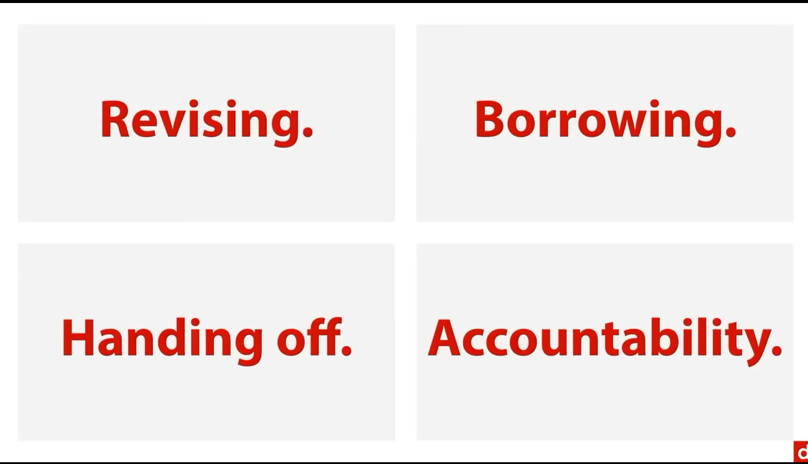
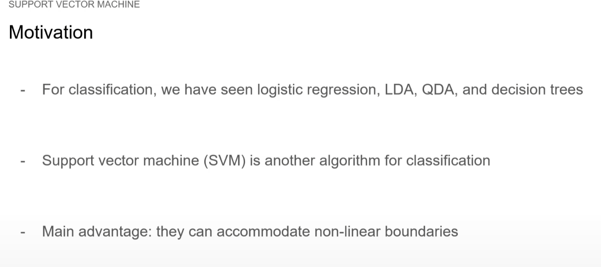
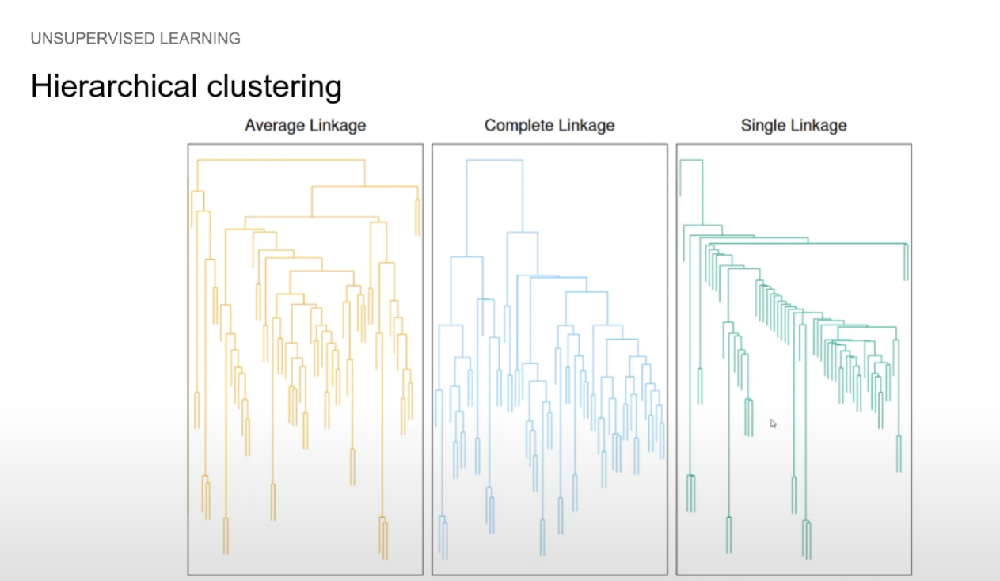
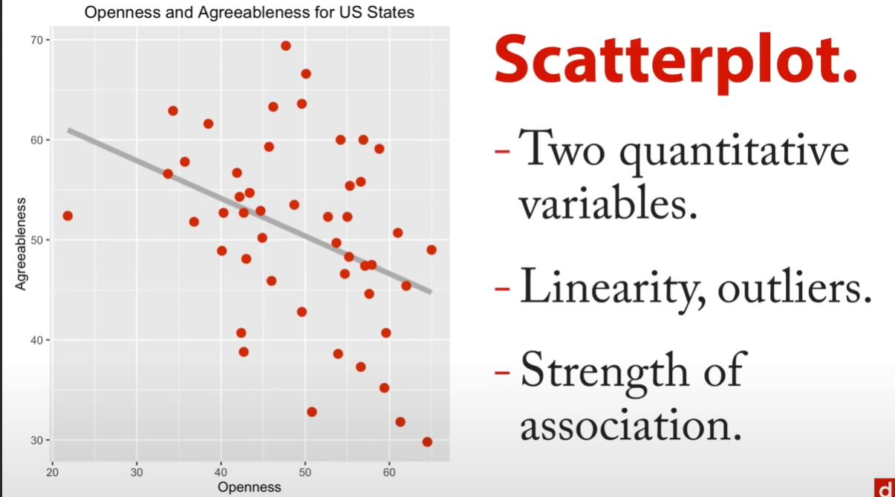
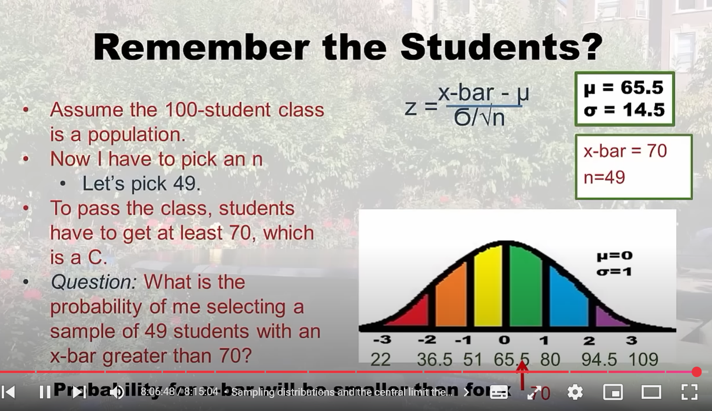
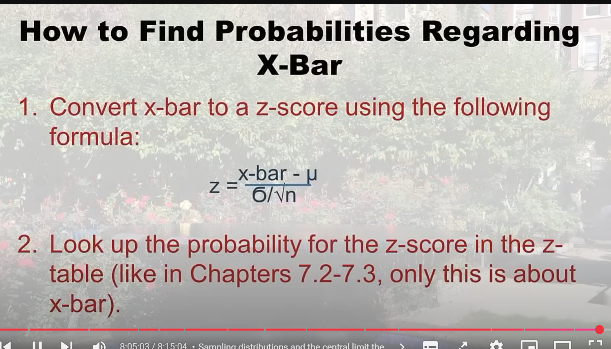

# Data Science Course

About: FreeCodeCamp
Tags: Coding, Course, Project
Due: Accomplised💪

# Quick Links

https://www.youtube.com/watch?v=RBSUwFGa6Fk&t=15s

https://www.youtube.com/watch?v=s5CfWgburUk

https://www.youtube.com/watch?v=kWZEXXd2tZA

https://www.youtube.com/watch?v=PSNXoAs2FtQ

https://www.youtube.com/watch?v=Rt6beTKDtqY

https://www.youtube.com/watch?v=wOTFGRSUQ6Q

https://www.youtube.com/watch?v=6JkPQKWQn4I

https://www.youtube.com/watch?v=xxpc-HPKN28&list=PLWKjhJtqVAblQe2CCWqV4Zy3LY01Z8aF1&index=3

https://www.youtube.com/watch?v=ua-CiDNNj30&list=PLWKjhJtqVAblQe2CCWqV4Zy3LY01Z8aF1&index=2

https://www.youtube.com/watch?v=LHBE6Q9XlzI&list=PLWKjhJtqVAblQe2CCWqV4Zy3LY01Z8aF1&index=4

https://www.youtube.com/watch?v=GPVsHOlRBBI&list=PLWKjhJtqVAblQe2CCWqV4Zy3LY01Z8aF1&index=5

https://www.youtube.com/watch?v=XU5pw3QRYjQ&list=PLWKjhJtqVAblQe2CCWqV4Zy3LY01Z8aF1&index=8

# Notes

### Problem → Target → Metrics → Explanation → Communication

## Machine Learning

- Use Tablue public software for studying data
- Numpy scipy matplot lib seaborn regex pandas scikit-learn mysql shell github kaggle APIs json csv
- Process of studying data and business expertise and utilization of ai algorithms to identify features and manipulate them for target outcome or profit
- How to think?
    - Identify the problem → what exactly am i solving?
    - Identify the target → whats the objective?
    - Identify metrics → what exact metrics can i use to achieve this objective?
    - Verify → verify the relationship of metrics and objective
    - Communicate with the team
- Common Models Used in Data Analysis
    - Linear Regression → finding best fit line between features in different dimensions
    - PCA → to find relationships between unsupervised data of different relationships and complex dimensions
    - K-Means Clustering → Clustering similar features and forming clusters
    - KNN → finding nearrest neighbour by calculating euclien distance
- we always reshape data to make it accessible for algorithsm and model to work with, basically converting it to different dimensions for requirements, Since Linear algebra uses matrix algebra for calculations, its important to conver ti tt o 2d arrays
- Linear Regression
    - **Purpose**: Predicts a continuous outcome based on one or more predictors.
    - **Types**: Simple (one predictor) and Multiple (two or more predictors).
    - **Equation**: Y = β₀ + β₁X₁ + β₂X₂ + ... + ε
    - **Key Points**:
        - Assumes linear relationship between predictors and outcome.
        - Coefficients represent change in outcome for one-unit change in predictor.
        - R-squared indicates proportion of variance explained.
        - Assumes linearity, independence of errors, homoscedasticity, and normality of residuals.
- Logistic Regression
    - **Purpose**: Predicts probability of a binary outcome.
    - **Key Concept**: Models log-odds as a linear function of predictors.
    - **Equation**: log(p/(1-p)) = β₀ + β₁X₁ + β₂X₂ + ...
    - **Output**: Probabilities between 0 and 1.
    - **Decision Boundary**: Linear.
- Linear Discriminant Analysis (LDA)
    - **Purpose**: Classification and dimensionality reduction.
    - **Key Assumptions**:
        - Classes have same covariance matrix.
        - Features are normally distributed within each class.
    - **Decision Boundary**: Linear.
    - **Use When**: Small sample size, classes have similar covariance.
- Quadratic Discriminant Analysis (QDA)
    - **Purpose**: Classification with more flexibility than LDA.
    - **Key Difference from LDA**: Allows each class to have its own covariance matrix.
    - **Decision Boundary**: Quadratic (non-linear).
    - **Use When**: Larger sample size, classes have different covariances.
- Bayes' Theorem
    - **Formula**: P(H|E) = (P(E|H) * P(H)) / P(E)
    - **Application**: Fundamental in probabilistic machine learning models.
- Choosing Between Methods
    - **Linear Regression**: For continuous outcomes, linear relationships.
    - **Logistic Regression**: For binary outcomes, flexible feature relationships.
    - **LDA**: For classification with limited data, similar class covariances.
    - **QDA**: For classification with more data, different class covariances.
- A ROC (Receiver Operating Characteristic) curve is a graphical representation used to evaluate the performance of binary classification models. It plots the True Positive Rate (TPR) against the False Positive Rate (FPR) at various classification thresholds.
- One hot encoding → it converst different valuesi n a dataset to either 0 or 1 same as label encoder
    
    
    | Aspect | Label Encoding | One Hot Encoding |
    | --- | --- | --- |
    | **Definition** | Assigns a unique integer to each category | Creates binary columns for each category |
    | **Example Input** | Colors: [Red, Blue, Green] | Colors: [Red, Blue, Green] |
    | **Example Output** | [0, 1, 2] | [[1, 0, 0], [0, 1, 0], [0, 0, 1]] |
    | **Number of Features** | Same as original (1 column) | Increases (3 columns in this example) |
    | **Implied Ordinality** | Yes (0 < 1 < 2) | No |
    | **Memory Usage** | Less | More |
    | **Suitable for** | Ordinal data, Tree-based models | Nominal data, Linear models, Neural networks |
    | **Handling New Categories** | Easy (assign new integer) | Challenging (may need to retrain) |
- The confusion matrix is a crucial tool in evaluating the performance of classification models. Its importance and reasons for use include:
    1. **Comprehensive Performance View**: It provides a complete picture of the model's performance across all classes, not just overall accuracy.
    2. **Error Type Identification**: It distinguishes between different types of errors:
        - False Positives (Type I errors)
        - False Negatives (Type II errors)
    3. **Class-specific Performance**: It shows how well the model performs for each class, which is crucial in imbalanced datasets.
    4. **Metric Calculation**: It's the basis for calculating various performance metrics such as:
        - Accuracy
        - Precision
        - Recall
        - F1-score
    5. **Model Comparison**: It allows for easy comparison between different models or different versions of the same model.
    6. **Threshold Adjustment**: It helps in deciding the optimal threshold for classification, especially in binary problems.
    7. **Business Impact Assessment**: It aids in understanding the real-world implications of model errors.
    8. **Model Refinement**: It provides insights into where the model is failing, guiding further improvements.
    
    In the given code, confusion matrices are calculated for each model (Logistic Regression, LDA, QDA) using:
    
    ```python
    confusion_matrix(y_test, y_pred)
    ```
    
    This allows for a detailed comparison of how each model performs in classifying mushrooms as edible or poisonous, showing not just how many were correctly classified, but also the nature of the misclassifications.
    
- Key points:
    - Training data is used to fit the model.
    - Validation data helps in model selection and hyperparameter tuning.
    - Test data provides an unbiased evaluation of the final model.
    - Validation can be part of cross-validation in some workflows.
    - Test data should only be used once the model is finalized.
    
    | Dataset | Purpose | When Used | Characteristics |
    | --- | --- | --- | --- |
    | X_train, y_train | Model training | During model fitting | Largest portion of data; used to learn patterns |
    | X_validation, y_validation | Model tuning | After initial training, before final testing | Used to tune hyperparameters and prevent overfitting |
    | X_test, y_test | Final evaluation | After model is fully trained and tuned | Held-out data; used to assess final model performance |
- When to use Ridge Regression:
    - When you have many relevant features and want to keep all of them in the model
    - When dealing with multicollinearity among features
    - When you want to reduce model complexity without eliminating variables
    - Equation explanation:
    Loss = MSE + λ∑β²ᵢ
        - MSE is the mean squared error
        - λ (lambda) is the regularization parameter
    - ∑β²ᵢ is the sum of squared coefficients
    This equation adds a penalty proportional to the square of the coefficients, which helps to shrink them towards zero without eliminating any.
- When to use Lasso Regression:
    - When you want to perform feature selection (eliminate less important features)
    - When you have a high number of features and suspect only a few are significant
    - When you need a simpler, more interpretable model
    
    Equation explanation:
    Loss = MSE + λ∑|βᵢ|
    
    - MSE is the mean squared error
    - λ (lambda) is the regularization parameter
    - ∑|βᵢ| is the sum of absolute values of coefficients
    This equation adds a penalty proportional to the absolute value of the coefficients, which can force some coefficients to become exactly zero, effectively removing those features from the model.
    
    | Aspect | Ridge Regression | Lasso Regression |
    | --- | --- | --- |
    | Regularization Type | L2 regularization | L1 regularization |
    | Penalty Term | Squared magnitude of coefficients | Absolute value of coefficients |
    | Feature Selection | Does not perform feature selection | Can perform feature selection |
    | Coefficient Shrinkage | Shrinks coefficients towards zero, but not to zero | Can shrink coefficients to exactly zero |
    | Equation | Loss = MSE + λ∑β²ᵢ | Loss = MSE + λ∑ |
    
    Both methods introduce bias to reduce variance, potentially improving overall model predictions. The choice between Ridge and Lasso depends on your specific data characteristics and modeling goals.
    
- DataFrames are inherently 2D structures, so no reshaping is needed.
- GridSearchCV is a powerful technique in machine learning for hyperparameter tuning. It systematically works through multiple combinations of parameter tunes, cross-validating as it goes to determine which tune gives the best performance. Here are the key aspects of GridSearchCV:
    1. Hyperparameter Tuning: GridSearchCV is used to find the optimal values for a model's hyperparameters, which are parameters set before the learning process begins.
    2. Exhaustive Search: It performs an exhaustive search over a specified parameter grid, trying all possible combinations of parameter values.
    3. Cross-Validation: The "CV" in GridSearchCV stands for cross-validation. It typically uses k-fold cross-validation to evaluate each combination of parameters.
    4. Scoring Metric: GridSearchCV uses a specified scoring metric (e.g., accuracy, F1-score) to evaluate the performance of each parameter combination.
    5. Best Model Selection: After trying all combinations, it selects the set of parameters that yielded the best performance based on the chosen scoring metric.
    6. Automation: It automates the process of trying different hyperparameter combinations, saving time and reducing manual effort.
    7. Scikit-learn Implementation: In Python, GridSearchCV is commonly implemented using the scikit-learn library.
    
    While GridSearchCV is thorough, it can be computationally expensive, especially with a large parameter space or dataset. For this reason, alternatives like RandomizedSearchCV are sometimes preferred for initial broad searches before refining with GridSearchCV.
    
- Decision trees are a popular machine learning algorithm used for both classification and regression tasks. They work by creating a model that predicts the value of a target variable by learning simple decision rules inferred from the data features. Here's a breakdown of key aspects of decision trees:
    - Structure and Functionality
        1. **Tree-like Structure**:
            - Root Node: The topmost node, representing the entire dataset.
            - Internal Nodes: Decision points based on features.
            - Leaf Nodes: Final predictions or decisions.
        2. **Decision Making Process**:
            - At each node, the tree splits the data based on a feature and a threshold.
            - The goal is to create homogeneous subsets of data.
        3. **Splitting Criteria**:
            - For classification: Gini impurity, Information gain, or Entropy.
            - For regression: Reduction in variance.
    - Advantages
        1. **Interpretability**: Easy to understand and visualize.
        2. **Handling Non-linear Relationships**: Can capture complex patterns.
        3. **No Feature Scaling Required**: Works with both numerical and categorical data without preprocessing.
        4. **Feature Importance**: Provides a measure of feature importance.
    - Limitations
        1. **Overfitting**: Prone to creating overly complex trees that don't generalize well.
        2. **Instability**: Small changes in data can result in a completely different tree.
        3. **Biased with Imbalanced Datasets**: Can be biased towards dominant classes.
    - Use Cases
        - Customer segmentation
        - Fraud detection
        - Medical diagnosis
        - Predictive maintenance
- Key differences:
    - Bagging uses bootstrap sampling with all features available for splits.
    - Random Forest uses bootstrap sampling with a subset of features for splits.
    - Boosting trains models sequentially, focusing on misclassified instances.
    
    | Aspect | Bagging | Random Forest | Boosting |
    | --- | --- | --- | --- |
    | Dataset Usage | Subset (bootstrap sampling) | Subset (bootstrap sampling) | Entire dataset or subset |
    | Feature Selection | All features used for splits | Subset of features used for splits | All features or subset used for splits |
    | Model Training | Parallel | Parallel | Sequential |
    | Purpose | Reduces variance | Reduces variance | Reduces bias and variance |
    | Base Learners | Typically decision trees | Decision trees | Typically decision trees |
    | Voting Method | Equal weight (majority vote) | Equal weight (majority vote) | Weighted voting |
    | Handling Overfitting | Helps reduce overfitting | Helps reduce overfitting | Can overfit with too many iterations |
    | Performance | Good | Better than Bagging | Often best performance |
    | Suitable When | Classifier is unstable (high variance) | Classifier is unstable (high variance) | Classifier is stable and simple (high bias) |
    | Example Algorithm | - | Random Forest | AdaBoost, Gradient Boosting |
- Bias-Variance Tradeoff:
    - As model complexity increases, bias tends to decrease and variance tends to increase.
    - The goal in machine learning is to find the sweet spot that minimizes both bias and variance, leading to a model that generalizes well to unseen data.
- Visual representation:
    
    [Imagine a target where the bullseye is the true value]
    
    - High Bias, Low Variance: Shots are clustered, but far from the bullseye.
    - Low Bias, High Variance: Shots are spread out, but centered around the bullseye.
    - Low Bias, Low Variance (Ideal): Shots are tightly clustered around the bullseye.
- **Quick Rule of Thumb:**
    - High numbers on the diagonal (top-left and bottom-right)
    - Low or zero numbers off the diagonal (top-right and bottom-left)
    
    Visual Guide:
    
    ```
    [HIGH   LOW ]
    [LOW    HIGH]
    
    ```
    
    Why this works:
    
    1. Top-left: True Negatives (correctly identified negative cases)
    2. Bottom-right: True Positives (correctly identified positive cases)
    3. Top-right: False Positives (incorrectly labeled as positive)
    4. Bottom-left: False Negatives (incorrectly labeled as negative)
    
    Example of a good model:
    
    ```
    [98    2 ]
    [1     99]
    
    ```
    
    Example of a poor model:
    
    ```
    [50    50]
    [45    55]
    
    ```
    
    Remember: In medical diagnostics or critical applications, you might need to pay special attention to false negatives (bottom-left) as these might be more costly errors than false positives (top-right).
    
    This quick visual check helps you quickly assess model performance before diving into detailed metrics like accuracy, precision, and recall.
    
- Support Vector Machine (SVM) is a powerful supervised learning algorithm used for both classification and regression tasks. However, it's most commonly used for classification problems.
    - Key Terms and Concepts
        1. **Hyperplane**:
            - Think of it as a decision boundary that separates different classes
            - In 2D, it's a line
            - In 3D, it's a plane
            - In higher dimensions, we call it a hyperplane
        2. **Support Vectors**:
            - These are the data points nearest to the hyperplane
            - They "support" or define the position of the hyperplane
            - They are crucial as they determine the margin of the classifier
        3. **Margin**:
            - The distance between the hyperplane and the nearest data points (support vectors)
            - We want to maximize this margin for better classification
            - Larger margin = Better generalization
        4. **Kernel Functions**:
            - Tools that help SVM handle non-linear data
            - Common kernels include:
                - Linear: For linearly separable data
                - RBF (Radial Basis Function): For non-linear data
                - Polynomial: For more complex decision boundaries
        5. **Soft Margin**:
            - Allows some misclassification for better generalization
            - Controlled by the C parameter (higher C = less tolerance for misclassification)
    - Why SVM is Important
        1. **Effectiveness**:
            - Works well with high-dimensional data
            - Effective in cases where number of dimensions is greater than samples
        2. **Memory Efficiency**:
            - Uses only a subset of training points (support vectors)
            - Efficient in terms of memory usage
        3. **Versatility**:
            - Can handle both linear and non-linear classification
            - Different kernel functions make it adaptable to various types of data
        - Practical Tips
            1. **When to Use SVM**:
                - Medium to small datasets
                - When you need a clear margin of separation
                - When dealing with high-dimensional data
            2. **Parameter Tuning**:
                - C parameter: Controls trade-off between margin size and misclassification
                - Kernel selection: Based on data separability
                - Kernel parameters: Like gamma in RBF kernel
- How SVM Finds the Separating Line (Hyperplane)
    1. **Mathematical Objective**:
    - SVM aims to find the hyperplane that maximizes the margin between classes
    - It solves an optimization problem: maximize margin while minimizing classification errors
    - The mathematical formula is: min (1/2)||w||² + C∑ξᵢ
    where w is the normal vector to the hyperplane and C controls the trade-off between margin size and error tolerance
    1. **Feature Space and Kernel Trick**:
    - For non-linear relationships (like in your second image), SVM uses the "kernel trick"
    - It transforms data into higher dimensions where linear separation becomes possible
    - Common kernels:
        - Linear: K(x,y) = x^T y
        - RBF: K(x,y) = exp(-γ||x-y||²)
- Handling Multiple Features
    1. **High Dimensional Space**:
    - SVM naturally handles high-dimensional data
    - Each feature becomes a dimension in the feature space
    - The hyperplane becomes a decision boundary in this high-dimensional space
    1. **Feature Impact**:
    - Bad features don't necessarily disrupt performance
    - SVM automatically assigns weights to features during optimization
    - Less relevant features get smaller weights
    - Regularization (C parameter) helps handle noisy features
- When to Use SVM
    
    SVMs are particularly useful when:
    
    1. You have clear margin of separation
    2. Working with high-dimensional data
    3. Number of dimensions > number of samples
    4. Need non-linear classification (using kernels)
- Common Use Cases
    - Text classification
    - Image classification
    - Bioinformatics
    - Face detection
    - Financial analysis
- Limitations
    1. Not efficient for very large datasets
    2. Sensitive to kernel choice and parameters
    3. Less interpretable than simpler models
    4. Computationally intensive for non-linear kernels
    
    The two images you've shared perfectly illustrate:
    
    1. Linear SVM (first image): Simple linear separation
    2. Non-linear SVM (second image): Complex decision boundary using kernel trick
- The parameter C in SVM is the regularization parameter that controls the trade-off between achieving a larger margin and minimizing classification errors. Let me explain its significance:
    1. When C is small (e.g., C = 0.1 or 1.0):
        - Allows for a larger margin
        - More tolerant of errors
        - Smoother decision boundary
        - May underfit if too small
        - Less sensitive to outliers
    2. When C is large (e.g., C = 100):
        - Creates a smaller margin
        - Less tolerant of errors
        - More complex decision boundary
        - May overfit if too large
        - More sensitive to outliers
    
    The effect of changing C values:
    
    - Increasing C: Makes the boundary more closely fit the training data, potentially creating more complex curves
    - Decreasing C: Makes the boundary smoother and more generalized, potentially ignoring some data points
    
    Best practice:
    
    - Start with C = 1.0 (default)
    - Use cross-validation to find the optimal C value for your specific dataset
    - Balance between overfitting (high C) and underfitting (low C)
- KNN is a supervised learning algorithm used for both classification and regression. It makes predictions based on the 'k' closest training examples in the feature space.
    - Mathematical Background
        1. **Distance Calculation**:
            - Typically uses Euclidean distance:
            
            ```
            d = √[(x₁-y₁)² + (x₂-y₂)² + ... + (xₙ-yₙ)²]
            
            ```
            
            - Can also use other metrics:
                - Manhattan distance
                - Minkowski distance
                - Hamming distance (for categorical variables)
        2. **Prediction Process**:
            - For classification: majority vote among k neighbors
            - For regression: average of k neighbors' values
    - When to Use KNN
        1. Small to medium-sized datasets
        2. Low-noise datasets
        3. When you need interpretable results
        4. When you have enough computational power
- K-means is an unsupervised learning algorithm that partitions data into k clusters based on feature similarity.
    - Mathematical Process
        1. **Initialization**:
            - Randomly select k points as initial centroids
            - μⱼ represents centroid of cluster j
        2. **Assignment Step**:
            - Assign each point to nearest centroid
            - For each point x:
                
                ```
                cluster(x) = argmin||x - μⱼ||²
                
                ```
                
        3. **Update Step**:
            - Recalculate centroids as mean of assigned points
            - For each cluster j:
            where Cⱼ is the set of points in cluster j
                
                ```
                μⱼ = (1/|Cⱼ|)∑ xᵢ
                
                ```
                
        4. **Convergence**:
            - Repeat steps 2-3 until centroids stabilize
            - Objective function (minimize):
                
                ```
                J = ∑∑||xᵢ - μⱼ||²
                
                ```
                
        
        ### Key Differences
        
        | Aspect | KNN | K-means |
        | --- | --- | --- |
        | Type | Supervised | Unsupervised |
        | Purpose | Classification/Regression | Clustering |
        | Training | Lazy learning (no training) | Iterative training |
        | Computation | Heavy during prediction | Heavy during training |
        
        ### Practical Considerations
        
        1. **For KNN**:
            - Choice of k is crucial
            - Feature scaling is important
            - Curse of dimensionality affects performance
        2. **For K-means**:
            - Need to specify number of clusters
            - Sensitive to initial centroid positions
            - May converge to local optima
        
        ### Example Use Cases
        
        1. **KNN Applications**:
            - Recommendation systems
            - Pattern recognition
            - Missing value imputation
        2. **K-means Applications**:
            - Customer segmentation
            - Image compression
            - Document clustering
        
        ### Code Example
        
        ```python
        # KNN Example
        from sklearn.neighbors import KNeighborsClassifier
        knn = KNeighborsClassifier(n_neighbors=5)
        knn.fit(X_train, y_train)
        predictions = knn.predict(X_test)
        
        # K-means Example
        from sklearn.cluster import KMeans
        kmeans = KMeans(n_clusters=3, random_state=42)
        kmeans.fit(X)
        clusters = kmeans.predict(X)
        
        ```
        
        ### Visualization
        
        ```python
        # KNN Decision Boundary
        plt.scatter(X[:, 0], X[:, 1], c=y, cmap='viridis')
        plt.title('KNN Classification')
        
        # K-means Clusters
        plt.scatter(X[:, 0], X[:, 1], c=clusters, cmap='viridis')
        plt.scatter(kmeans.cluster_centers_[:, 0],
                   kmeans.cluster_centers_[:, 1],
                   marker='*',
                   c='red',
                   s=200)
        plt.title('K-means Clustering')
        
        ```
        
        Remember:
        
        - Both algorithms are sensitive to the choice of k
        - Both require careful preprocessing of data
        - Understanding the underlying mathematics helps in proper implementation and troubleshooting
- K-means effectively reduces image colors while maintaining visual quality
- PCA successfully reduces 4D iris data to 2D while preserving 97.8% of variance (shown in explained_variance_ratio_)

## Statistics

- Dividing big chunks of data into large categories with filters in relationship to the objective
1. Stratified Sampling → Categorizing and filtering data
2. Systematic Sampling → like merge sort/quick sort or KN Clustering, random individual of the population in a particular order
3. Cluster Sampling → KNN 
4. Convenience Sampling
5. Multi Stage Sampling → Stage 1 cluster sample of states, 2 simple random sample of counties,  3 stratified sample of schools,  4 stratified sample of classrooms
- In a census, measurements or observations from the entire population are used
- in a sample, measurements or observations from part of the population are used
-

# Snap Shots




















